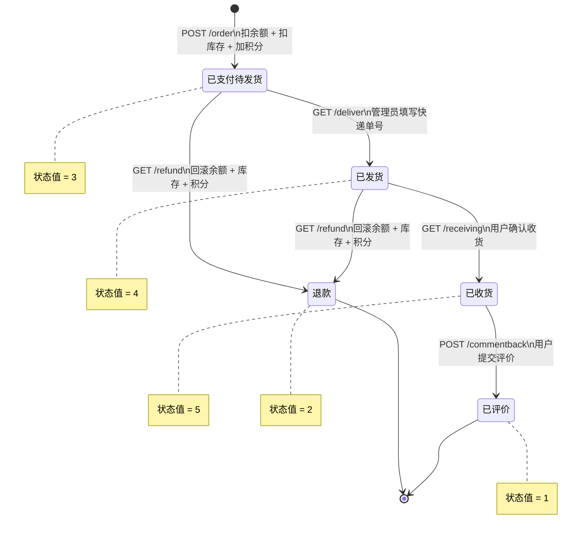
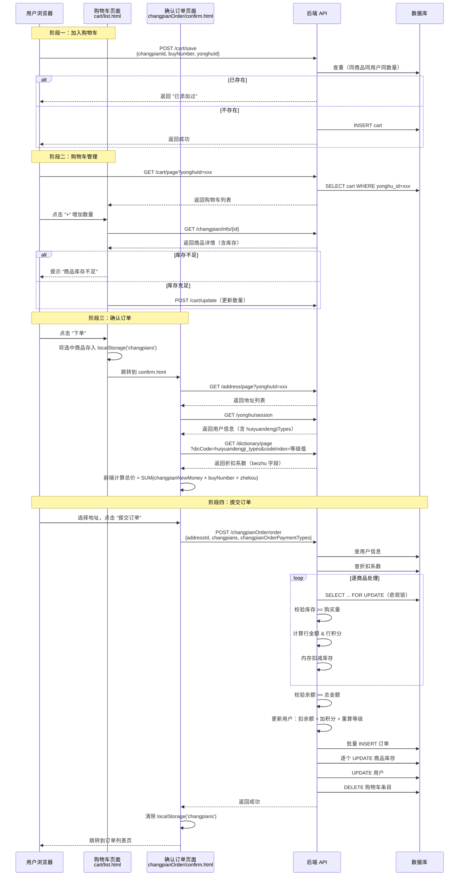

# 怀旧唱片订单子系统架构与 API 对照

> 面向客服团队的内部技术文档。以 `ChangpianOrderController` 为主线，覆盖订单全生命周期。
>
> 源码主路径：`huaijiuchangpianshoumai/src/main/java/com/`

---

## 目录

1. [订单状态定义（changpianOrderTypes）](#1-订单状态定义changpianordertypes)
2. [支付类型定义（changpianOrderPaymentTypes）](#2-支付类型定义changpianorderpaymenttypes)
3. [订单状态机（Mermaid）](#3-订单状态机mermaid)
4. [API 总览](#4-api-总览)
5. [POST /order — 下单](#5-post-order--下单)
6. [GET /refund — 退款](#6-get-refund--退款)
7. [GET /deliver — 发货](#7-get-deliver--发货)
8. [GET /receiving — 收货](#8-get-receiving--收货)
9. [POST /commentback — 评价](#9-post-commentback--评价)
10. [会员等级与折扣体系](#10-会员等级与折扣体系)
11. [购物车到下单时序图（Mermaid）](#11-购物车到下单时序图mermaid)
12. [/deliver 与 /receiving 缺少前置校验的风险表](#12-deliver-与-receiving-缺少前置校验的风险表)
13. [/refund 退款金额与实付金额不一致的行为差异](#13-refund-退款金额与实付金额不一致的行为差异)
14. [数据库表结构速查](#14-数据库表结构速查)

---

## 1. 订单状态定义（changpianOrderTypes）

定义位置：`service/impl/ChangpianOrderServiceImpl.java:41-45`

| 常量名 | 值 | 中文含义 | 说明 |
|---|---|---|---|
| `STATUS_YI_PINGJIA` | 1 | 已评价 | 终态，用户完成评价后进入 |
| `STATUS_TUIKUAN` | 2 | 退款 | 终态，退款完成后进入 |
| `STATUS_YI_ZHIFU` | 3 | 已支付（待发货） | 下单成功后的初始状态 |
| `STATUS_YI_FAHUO` | 4 | 已发货 | 管理员填写快递信息后进入 |
| `STATUS_YI_SHOUHUO` | 5 | 已收货 | 用户确认收货后进入 |

> **注意**：系统中没有"待支付"状态。下单即扣款，订单直接创建为状态 3（已支付）。

---

## 2. 支付类型定义（changpianOrderPaymentTypes）

| 值 | 中文含义 | 说明 |
|---|---|---|
| 1 | 余额支付 | 当前唯一实现的支付方式，从用户 `newMoney` 字段扣除 |

> 代码中只处理了 `changpianOrderPaymentTypes == 1` 的分支。如果传入其他值，订单会被创建但不扣余额、不加积分、不计算折扣。

---

## 3. 订单状态机（Mermaid）



**允许的状态流转一览**：

| 当前状态 | 可执行操作 | 目标状态 |
|---|---|---|
| 3（已支付） | 发货 `/deliver` | 4（已发货） |
| 3（已支付） | 退款 `/refund` | 2（退款） |
| 4（已发货） | 收货 `/receiving` | 5（已收货） |
| 4（已发货） | 退款 `/refund` | 2（退款） |
| 5（已收货） | 评价 `/commentback` | 1（已评价） |

**不允许的操作**（后端会返回 511 错误）：

| 当前状态 | 禁止的操作 | 错误提示 |
|---|---|---|
| 3（已支付） | 收货 | 只有已发货状态可以收货 |
| 4（已发货） | 再次发货 | 只有已支付（待发货）状态可以发货 |
| 5（已收货） | 退款 | 只有已支付或已发货状态可以退款 |
| 5（已收货） | 再次收货 | 只有已发货状态可以收货 |
| 1（已评价） | 任何操作 | 终态，不可变更 |
| 2（退款） | 任何操作 | 终态，不可变更 |

---

## 4. API 总览

Controller 类：`controller/ChangpianOrderController.java`
请求路径前缀：`/changpianOrder`

| 接口路径 | HTTP 方法 | 角色 | 用途 |
|---|---|---|---|
| `/page` | GET | 通用 | 分页查询订单列表（后端管理） |
| `/info/{id}` | GET | 通用 | 订单详情（后端管理） |
| `/list` | GET | 前端用户 | 前端分页查询订单列表 |
| `/detail/{id}` | GET | 前端用户 | 前端订单详情 |
| `/save` | POST | 管理员 | 后端直接新增订单记录 |
| `/update` | POST | 管理员 | 后端修改订单 |
| `/delete` | POST | 管理员 | 批量删除订单 |
| `/add` | POST | 前端用户 | 简化版下单（不走完整流程） |
| **`/order`** | **POST** | **前端用户** | **完整下单流程（推荐）** |
| **`/refund`** | **GET** | **前端用户** | **退款** |
| **`/deliver`** | **GET** | **管理员** | **发货** |
| **`/receiving`** | **GET** | **前端用户** | **确认收货** |
| `/commentback` | POST | 前端用户 | 评价订单 |
| `/batchInsert` | POST | 管理员 | Excel 批量导入订单 |

---

## 5. POST /order — 下单

**Controller**：`ChangpianOrderController.java:373-388`
**Service**：`ChangpianOrderServiceImpl.java:76-199`

### 5.1 请求参数

| 参数名 | 来源 | 类型 | 说明 |
|---|---|---|---|
| `userId` | `session.userId` | Integer | 当前登录用户 ID（后端从 session 获取） |
| `addressId` | request param | Integer | 收货地址 ID |
| `changpianOrderPaymentTypes` | request param | Integer | 支付类型（固定传 1） |
| `changpians` | request param | JSON String | 商品数组，结构：`[{"changpianId":1,"buyNumber":2,"id":3}, ...]`，其中 `id` 为购物车条目 ID（可选） |

### 5.2 执行流程

```
1. 生成订单号 ← 当前时间戳毫秒值 new Date().getTime()
2. 查询用户信息 → 不存在则返回 511 "用户不存在"
3. 查询会员折扣
   └─ 字典表: dic_code='huiyuandengji_types', code_index=用户当前等级
   └─ beizhu 字段即为折扣系数（如 "1.0"、"0.9"）
   └─ 查不到则默认 1.0（无折扣）
4. 第一轮 — 逐商品悲观锁校验：
   ├─ SELECT ... FOR UPDATE 锁定商品行
   ├─ 校验：商品存在？价格非空？库存 >= 购买量？
   ├─ 库存扣减：changpianKucunNumber -= buyNumber
   ├─ 金额计算：lineMoney = changpianNewMoney × buyNumber × zhekou
   ├─ 积分计算：lineJifen = changpianPrice × buyNumber
   └─ 构造 ChangpianOrderEntity（状态=3，实付价格=lineMoney）
5. 第二轮 — 余额校验：
   └─ if newMoney == null || newMoney - totalMoney < 0 → "余额不足,请充值！！！"
6. 第三轮 — 更新用户数据：
   ├─ newMoney -= totalMoney         （扣余额）
   ├─ yonghuSumJifen += totalBuyJifen （加积分）
   └─ huiyuandengjiTypes = calculateMembershipTier(yonghuSumJifen) （重算等级）
7. 第四轮 — 持久化（同一事务）：
   ├─ 批量插入订单记录
   ├─ 逐个更新商品库存
   ├─ 更新用户余额/积分/等级
   └─ 删除对应购物车条目
```

### 5.3 对各子系统的影响

| 子系统 | 影响方式 | 计算公式 |
|---|---|---|
| **库存** | 扣减 | `changpianKucunNumber -= buyNumber`（悲观锁保护） |
| **余额** | 扣减 | `newMoney -= changpianNewMoney × buyNumber × zhekou` |
| **积分** | 增加 | `yonghuSumJifen += changpianPrice × buyNumber` |
| **会员等级** | 重算 | 根据新的 `yonghuSumJifen` 值查阈值表重新计算（见[会员等级体系](#10-会员等级与折扣体系)） |
| **购物车** | 清除 | 删除 changpians 数组中携带的 cart `id` 对应的购物车条目 |

### 5.4 并发安全

- 使用 `SELECT ... FOR UPDATE` 悲观锁锁定商品行，防止超卖
- 锁定粒度：单商品行级锁
- 整个方法在 `@Transactional` 事务中执行，失败自动回滚

---

## 6. GET /refund — 退款

**Controller**：`ChangpianOrderController.java:405-410`
**Service**：`ChangpianOrderServiceImpl.java:205-289`

### 6.1 请求参数

| 参数名 | 来源 | 类型 | 说明 |
|---|---|---|---|
| `id` | request param | Integer | 订单 ID |
| `userId` | `session.userId` | Integer | 当前登录用户 ID（后端从 session 获取） |

### 6.2 前置状态校验

仅允许状态为 **3（已支付）** 或 **4（已发货）** 的订单退款。其他状态返回 511 错误。

### 6.3 执行流程

```
1. 查询订单 → 不存在则返回 511
2. 状态校验 → 非 3/4 则返回 511 "当前订单状态不允许退款"
3. 悲观锁查商品 → SELECT ... FOR UPDATE（防并发退款多加库存）
4. 查用户信息
5. 查当前折扣 ← 字典表按用户【当前】等级查
6. 回滚操作（仅余额支付 paymentType=1）：
   ├─ 退回余额：newMoney += changpianNewMoney × buyNumber × zhekou(当前)
   ├─ 扣减积分：yonghuSumJifen -= changpianPrice × buyNumber（下限 0）
   └─ 重算等级：calculateMembershipTier(newSumJifen)
7. 回滚库存：changpianKucunNumber += buyNumber
8. 订单状态 → 2（退款）
9. 持久化（同一事务）
```

### 6.4 对各子系统的影响

| 子系统 | 影响方式 | 计算公式 |
|---|---|---|
| **库存** | 恢复 | `changpianKucunNumber += buyNumber` |
| **余额** | 退回 | `newMoney += changpianNewMoney × buyNumber × zhekou(当前等级)` |
| **积分** | 扣减 | `yonghuSumJifen -= changpianPrice × buyNumber`（最低为 0） |
| **会员等级** | 重算 | 根据扣减后的积分重新计算 |

### 6.5 退款金额不等于实付金额的问题

详见 [第 13 节](#13-refund-退款金额与实付金额不一致的行为差异)。

---

## 7. GET /deliver — 发货

**Controller**：`ChangpianOrderController.java:417-421`
**Service**：`ChangpianOrderServiceImpl.java:296-315`

### 7.1 请求参数

| 参数名 | 来源 | 类型 | 说明 |
|---|---|---|---|
| `id` | request param | Integer | 订单 ID |
| `changpianOrderCourierNumber` | request param | String | 快递单号 |
| `changpianOrderCourierName` | request param | String | 快递公司名称 |

### 7.2 前置状态校验

仅允许状态为 **3（已支付/待发货）** 的订单发货。其他状态返回 511 错误。

### 7.3 执行流程

```
1. 查询订单 → 不存在则返回 511
2. 状态校验 → 非 3 则返回 511 "只有已支付（待发货）状态可以发货"
3. 更新订单：
   ├─ changpianOrderTypes = 4（已发货）
   ├─ changpianOrderCourierNumber = 快递单号
   └─ changpianOrderCourierName = 快递公司
```

### 7.4 对各子系统的影响

无。仅变更订单状态和快递信息，不影响库存/余额/积分/等级。

### 7.5 缺少的校验

详见 [第 12 节风险表](#12-deliver-与-receiving-缺少前置校验的风险表)。

---

## 8. GET /receiving — 收货

**Controller**：`ChangpianOrderController.java:435-439`
**Service**：`ChangpianOrderServiceImpl.java:322-339`

### 8.1 请求参数

| 参数名 | 来源 | 类型 | 说明 |
|---|---|---|---|
| `id` | request param | Integer | 订单 ID |

### 8.2 前置状态校验

仅允许状态为 **4（已发货）** 的订单确认收货。其他状态返回 511 错误。

### 8.3 执行流程

```
1. 查询订单 → 不存在则返回 511
2. 状态校验 → 非 4 则返回 511 "只有已发货状态可以收货"
3. 更新订单状态 → 5（已收货）
```

### 8.4 对各子系统的影响

无。仅变更订单状态。

### 8.5 缺少的校验

详见 [第 12 节风险表](#12-deliver-与-receiving-缺少前置校验的风险表)。

---

## 9. POST /commentback — 评价

**Controller**：`ChangpianOrderController.java:446-472`

### 9.1 请求参数

| 参数名 | 类型 | 说明 |
|---|---|---|
| `id` | Integer | 订单 ID |
| `commentbackText` | String | 评价文本内容 |
| `changpianCommentbackPingfenNumber` | Integer | 评分数值 |

### 9.2 执行流程

```
1. 查询订单 → 不存在则返回 511
2. 状态校验 → 非 5（已收货）则返回 511 "您不能评价"
3. 创建 ChangpianCommentbackEntity 并插入
4. 订单状态 → 1（已评价）
```

---

## 10. 会员等级与折扣体系

### 10.1 等级阈值（硬编码默认值）

定义位置：`service/impl/DictionaryServiceImpl.java:32`

```java
private static final double[] DEFAULT_THRESHOLDS = {0.0, 10000.0, 100000.0, 1000000.0};
```

| 等级编号 | 名称 | 积分阈值 | 说明 |
|---|---|---|---|
| 1 | 普通会员 | >= 0 | 默认等级 |
| 2 | 银卡会员 | >= 10,000 | 字典表可配：`dic_code='huiyuandengji_threshold'`, `code_index=2`, `beizhu='10000'` |
| 3 | 金卡会员 | >= 100,000 | 字典表可配：`dic_code='huiyuandengji_threshold'`, `code_index=3`, `beizhu='100000'` |

> 等级阈值优先从字典表 `huiyuandengji_threshold` 读取。若字典表未配置，回退到上述硬编码默认值。

### 10.2 等级计算逻辑

`DictionaryServiceImpl.calculateMembershipTier(double totalPoints)`（第 167-178 行）：

```
从最高等级（3）向下遍历，返回第一个满足 totalPoints >= threshold 的等级。
若所有阈值都不满足，返回等级 1。
```

### 10.3 折扣乘数

存储在字典表 `dic_code='huiyuandengji_types'`, `dic_name='会员等级类型'` 中，`beizhu` 字段为折扣系数：

| code_index（等级） | 典型 beizhu 值 | 含义 |
|---|---|---|
| 1（普通会员） | `"1.0"` | 无折扣 |
| 2（银卡会员） | `"0.9"` | 打九折 |
| 3（金卡会员） | `"0.8"` | 打八折（示例） |

> 折扣应用公式：`实付金额 = changpianNewMoney × buyNumber × zhekou`

### 10.4 等级升降时机

- **下单时**：积分增加后立即重算等级（可能升级）
- **退款时**：积分减少后立即重算等级（可能降级）

---

## 11. 购物车到下单时序图（Mermaid）



---

## 12. /deliver 与 /receiving 缺少前置校验的风险表

下表列出 `/deliver` 和 `/receiving` 两个端点在后端代码层面缺少的校验项及其风险影响。

### /deliver 风险

| 编号 | 缺失的校验 | 风险描述 | 当前状态 | 建议 |
|---|---|---|---|---|
| D-1 | **无角色/身份校验** | Controller 未检查调用者是否为管理员（`sessionTable=='users'`）。任何已登录用户（包括普通用户）都可以调用 `/deliver` 对任意订单执行发货操作。 | 仅前端 admin Vue 页面通过 `v-if="sessionTable=='users'"` 隐藏按钮，后端无防护。 | 后端增加角色校验，仅管理员可调用 |
| D-2 | **快递单号无格式校验** | `changpianOrderCourierNumber` 参数未做非空校验和格式校验，允许传入空字符串或任意文本。 | 仅前端 admin Vue 页面做了非空判断，后端无防护。 | 后端增加非空和格式校验 |
| D-3 | **快递公司名无校验** | `changpianOrderCourierName` 同上，无后端非空校验。 | 同上 | 后端增加非空校验 |
| D-4 | **未校验收货地址有效性** | 不检查订单关联的 `addressId` 对应的地址是否仍然存在或有效。 | 不影响状态流转，但可能导致后续物流信息不完整 | 可选校验 |
| D-5 | **未校验商品上下架状态** | 不检查对应商品的 `shangxiaTypes`（上下架）状态，已下架商品仍可发货。 | 业务上通常可接受（已付款的应发货） | 视业务需求决定 |

### /receiving 风险

| 编号 | 缺失的校验 | 风险描述 | 当前状态 | 建议 |
|---|---|---|---|---|
| R-1 | **无用户身份校验（高危）** | `receiveOrder(Integer orderId)` 方法仅接收订单 ID，不验证调用者是否为订单所有者。任何已登录用户都可以确认收货任何订单。 | 仅前端通过 `v-if="userId==scope.row.yonghuId"` 限制按钮可见性，后端完全无防护。 | **必须后端增加 `userId == order.yonghuId` 校验** |
| R-2 | **无快递签收确认** | 不校验物流状态是否真的已送达，仅凭用户点击即完成收货。 | 业界常见做法，但缺乏自动收货超时机制 | 可选增加自动收货定时任务 |
| R-3 | **确认收货不可逆** | 一旦状态变为 5（已收货），无法退回状态 4，且不允许退款。 | 设计如此，但对误操作无容错 | 建议增加收货后一定时间内可退款 |

### /commentback 风险

| 编号 | 缺失的校验 | 风险描述 | 当前状态 | 建议 |
|---|---|---|---|---|
| C-1 | **无用户身份校验** | 不验证评价者是否为订单所有者。任何登录用户可以对任意状态为 5 的订单提交评价。 | 前端通过 `v-if` 限制按钮可见性，后端无防护。 | 后端增加身份校验 |

---

## 13. /refund 退款金额与实付金额不一致的行为差异

### 13.1 问题描述

退款接口 **不使用** 订单中存储的 `changpianOrderTruePrice`（实付金额）来退款，而是根据以下公式**重新计算**退款金额：

```
退款金额 = changpianNewMoney(商品当前价格) × buyNumber × zhekou(用户当前会员折扣)
```

而下单时的实付金额为：

```
实付金额 = changpianNewMoney(下单时价格) × buyNumber × zhekou(下单时会员折扣)
```

### 13.2 导致差异的两个因素

| 因素 | 场景 | 结果 |
|---|---|---|
| **商品价格变动** | 管理员在下单后修改了 `changpianNewMoney`（商品现价） | 退款金额按新价格计算，与原始实付金额不同 |
| **会员等级变动** | 下单时积分增加触发等级升级（如普通→银卡），折扣从 1.0 变为 0.9。退款时用新等级查折扣 | 退款金额 = 商品价 × 0.9，但实际支付时是 商品价 × 1.0。**用户少退 10%** |

### 13.3 典型场景复现

**场景：用户下单后等级升级，退款少退钱**

```
前提条件：
  - 用户积分 = 9,500（普通会员，折扣 1.0）
  - 商品价格 changpianNewMoney = 100 元
  - 商品积分 changpianPrice = 600
  - 购买数量 = 1

下单时：
  实付金额 = 100 × 1 × 1.0 = 100.0 元   ← 存入 changpianOrderTruePrice
  新积分 = 9,500 + 600 = 10,100           ← 超过银卡阈值 10,000
  等级升级为银卡（折扣变为 0.9）

退款时：
  退款金额 = 100 × 1 × 0.9 = 90.0 元     ← 按当前等级折扣计算
  扣减积分 = 600                          ← 积分回退到 9,500
  等级降回普通会员

差额 = 100.0 - 90.0 = 10.0 元
用户实际损失 10 元（付了 100，只退了 90）
```

**场景：商品涨价后退款，用户多拿钱**

```
前提条件：
  - 下单时 changpianNewMoney = 80 元，用户付了 80 元
  - 管理员随后将 changpianNewMoney 改为 120 元

退款时：
  退款金额 = 120 × 1 × 1.0 = 120.0 元
  用户原本支付 80 元，现在退了 120 元
  差额 = +40 元（平台亏损）
```

### 13.4 客服应对指引

| 用户反馈 | 原因分析 | 解决方案 |
|---|---|---|
| "退款金额比我付的少" | 退款时用户会员等级高于下单时等级，导致折扣系数更低 | 需开发修复：退款应使用订单记录的 `changpianOrderTruePrice` 而非重新计算 |
| "退款金额比我付的多" | 商品在下单后涨价了 | 同上 |
| "退款后余额没增加" | 若 `changpianOrderPaymentTypes != 1`（非余额支付），退款代码不会执行余额回退逻辑 | 检查订单支付类型字段 |

### 13.5 代码定位

问题代码：`ChangpianOrderServiceImpl.java:258-261`

```java
// 当前代码（有问题）：使用商品当前价格 × 当前折扣重新计算
double refundMoney = new BigDecimal(changpianEntity.getChangpianNewMoney())
        .multiply(new BigDecimal(buyNumber))
        .multiply(BigDecimal.valueOf(zhekou)).doubleValue();

// 建议修复方向：应使用订单中记录的实付金额
// double refundMoney = changpianOrder.getChangpianOrderTruePrice();
```

---

## 14. 数据库表结构速查

### changpian_order（订单表）

| 字段名 | Java 字段 | 类型 | 说明 |
|---|---|---|---|
| `id` | id | Integer | 主键 |
| `changpian_order_uuid_number` | changpianOrderUuidNumber | String | 订单号（时间戳） |
| `address_id` | addressId | Integer | 收货地址 ID |
| `changpian_id` | changpianId | Integer | 商品 ID |
| `yonghu_id` | yonghuId | Integer | 用户 ID |
| `buy_number` | buyNumber | Integer | 购买数量 |
| `changpian_order_courier_number` | changpianOrderCourierNumber | String | 快递单号 |
| `changpian_order_courier_name` | changpianOrderCourierName | String | 快递公司 |
| `changpian_order_true_price` | changpianOrderTruePrice | Double | 实付金额 |
| `changpian_order_types` | changpianOrderTypes | Integer | 订单状态（1-5） |
| `changpian_order_payment_types` | changpianOrderPaymentTypes | Integer | 支付类型（1=余额） |
| `insert_time` | insertTime | Date | 创建时间 |
| `create_time` | createTime | Date | 创建时间 |

### changpian（商品表，关键字段）

| 字段名 | Java 字段 | 类型 | 说明 |
|---|---|---|---|
| `changpian_kucun_number` | changpianKucunNumber | Integer | 库存数量 |
| `changpian_old_money` | changpianOldMoney | Double | 原价 |
| `changpian_price` | changpianPrice | Integer | 购买获得积分（每件） |
| `changpian_new_money` | changpianNewMoney | Double | 现价（实际销售价） |
| `shangxia_types` | shangxiaTypes | Integer | 上下架（1=上架，2=下架） |

### yonghu（用户表，关键字段）

| 字段名 | Java 字段 | 类型 | 说明 |
|---|---|---|---|
| `new_money` | newMoney | Double | 用户余额 |
| `yonghu_sum_jifen` | yonghuSumJifen | Double | 累计积分 |
| `huiyuandengji_types` | huiyuandengjiTypes | Integer | 会员等级（1/2/3） |

### cart（购物车表）

| 字段名 | Java 字段 | 类型 | 说明 |
|---|---|---|---|
| `id` | id | Integer | 主键（下单时用于删除） |
| `yonghu_id` | yonghuId | Integer | 用户 ID |
| `changpian_id` | changpianId | Integer | 商品 ID |
| `buy_number` | buyNumber | Integer | 购买数量 |
