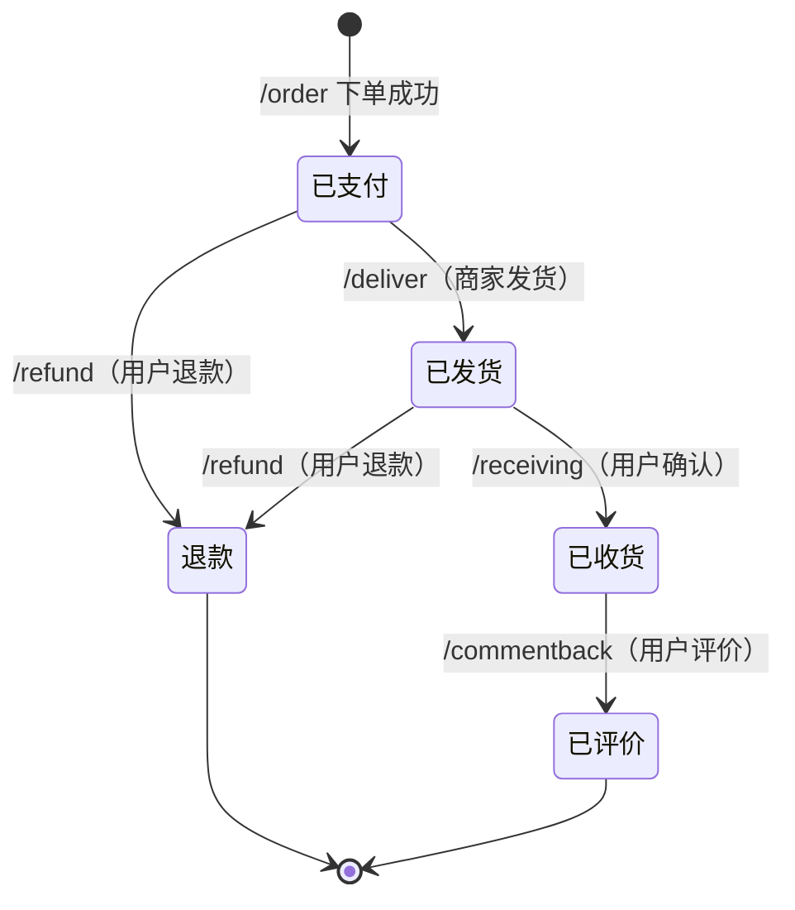
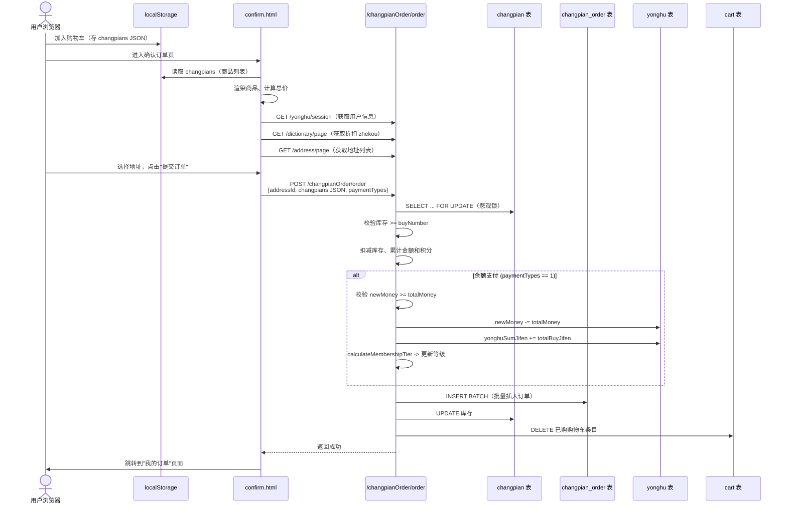

# 怀旧唱片订单子系统架构与 API 对照

> 适用受众：新客服、运营人员、后续开发者
> 最后更新：2026-06-13

---

## 一、系统概览

本子系统围绕 `ChangpianOrderController`（`/changpianOrder/*`）实现唱片电商的核心交易链路：购物车 → 下单 → 发货 → 收货 → 评价 → 退款。所有业务逻辑位于 `ChangpianOrderServiceImpl`，与 `ChangpianDao`（悲观锁）、`YonghuService`（用户余额/积分/会员等级）、`CartService`（购物车清理）、`DictionaryService`（字典/阈值）协同工作。

### 关键文件清单

| 层 | 文件路径 |
|---|---|
| Controller | `controller/ChangpianOrderController.java` |
| Service 接口 | `service/ChangpianOrderService.java` |
| Service 实现 | `service/impl/ChangpianOrderServiceImpl.java` |
| DAO | `dao/ChangpianOrderDao.java` + `mapper/ChangpianOrderDao.xml` |
| 商品 DAO（悲观锁） | `dao/ChangpianDao.java` + `mapper/ChangpianDao.xml` |
| Entity | `entity/ChangpianOrderEntity.java` |
| 字典服务 | `service/impl/DictionaryServiceImpl.java` |
| 购物车 | `controller/CartController.java` / `entity/CartEntity.java` |

---

## 二、订单状态字典（changpianOrderTypes）

字典编码：`changpian_order_types`，存储在 `dictionary` 表。

| code_index | 中文名称 | 常量名 | 说明 |
|:---:|---|---|---|
| 1 | 已评价 | `STATUS_YI_PINGJIA` | 订单终态——用户已提交评价 |
| 2 | 退款 | `STATUS_TUIKUAN` | 订单终态——退款完成 |
| 3 | 已支付（待发货） | `STATUS_YI_ZHIFU` | 下单默认初始状态；可执行发货或退款 |
| 4 | 已发货 | `STATUS_YI_FAHUO` | 商家已填写快递信息；可执行收货或退款 |
| 5 | 已收货 | `STATUS_YI_SHOUHUO` | 用户确认收货；可执行评价 |

### 订单状态流转图（Mermaid）



---

## 三、支付类型字典（changpianOrderPaymentTypes）

字典编码：`changpian_order_payment_types`。

| code_index | 中文名称 | 说明 |
|:---:|---|---|
| 1 | 余额支付 | 从用户 `newMoney` 扣款，获得积分、影响会员等级 |
| 2 | 积分支付 | **当前实现不完整**：仅扣库存、创建订单，不实际扣减积分，不影响余额和会员等级 |

---

## 四、会员等级与折扣（huiyuandengjiTypes）

### 4.1 等级阈值

字典编码：`huiyuandengji_threshold`。代码中 `DictionaryServiceImpl` 提供了 **硬编码回退默认值**：

```java
private static final double[] DEFAULT_THRESHOLDS = {0.0, 10000.0, 100000.0, 1000000.0};
```

| 等级 | 名称 | 最低累计积分（默认） | 说明 |
|:---:|---|---:|---|
| 1 | 普通会员 | 0 | 所有用户默认等级 |
| 2 | 银卡会员 | 10,000 | 累计积分 >= 10000 |
| 3 | 金卡会员 | 100,000 | 累计积分 >= 100000 |

> 等级判定逻辑（`calculateMembershipTier`）：从最高等级(3)向下遍历，返回第一个 `totalPoints >= threshold` 的等级。

### 4.2 折扣

折扣值存储在 `dictionary` 表中 `dic_code='huiyuandengji_types'`，`code_index=等级编号`，`beizhu=折扣系数`（如 `1.0`=无折扣，`0.9`=九折）。下单和退款时均实时查询。

---

## 五、核心 API 详细说明

### 5.1 `/changpianOrder/order` — 下单（购物车批量）

| 项目 | 说明 |
|---|---|
| HTTP 方法 | POST |
| 入口 | `ChangpianOrderController.add(params)` -> `placeOrder()` |
| 请求参数 | `addressId`（地址 ID）、`changpianOrderPaymentTypes`（1=余额/2=积分）、`changpians`（JSON 数组，每项含 `changpianId`、`buyNumber`、`id`（购物车条目 ID，可选）） |
| 事务 | `@Transactional`，所有操作在同一事务内 |

**执行流程与副作用：**

```
第一轮：悲观锁循环（逐个商品）
  |- SELECT ... FOR UPDATE 锁住商品行，防并发超卖
  |- 校验：商品存在、价格非空、库存 >= 购买数量
  |- 扣减库存：changpianKucunNumber -= buyNumber
  |- [余额支付] 累计金额：changpianNewMoney x buyNumber x 折扣
  +- [余额支付] 累计积分：changpianPrice x buyNumber

第二轮：余额校验
  +- [余额支付] newMoney - totalMoney >= 0，否则返回"余额不足"

第三轮：用户数据更新
  |- [余额支付] newMoney -= totalMoney
  |- [余额支付] yonghuSumJifen += totalBuyJifen
  +- [余额支付] 重新计算会员等级

第四轮：批量持久化
  |- 批量插入订单记录
  |- 逐个更新商品库存
  |- 更新用户信息
  +- 清理购物车（deleteBatchIds）
```

**对各项数据的影响汇总：**

| 影响项 | 余额支付 (paymentTypes=1) | 积分支付 (paymentTypes=2) |
|---|---|---|
| 商品库存 (`changpianKucunNumber`) | **-** buyNumber（悲观锁内） | **-** buyNumber（悲观锁内） |
| 用户余额 (`newMoney`) | **-** totalMoney（含折扣） | 不变 |
| 用户累计积分 (`yonghuSumJifen`) | **+** totalBuyJifen | 不变 |
| 会员等级 (`huiyuandengjiTypes`) | 重新计算（可能升级） | 不变 |
| 购物车条目 | 删除对应 ID | 删除对应 ID |
| 订单实付价格 (`changpianOrderTruePrice`) | 设为 `changpianNewMoney x buyNumber x 折扣` | **不设置**（保持默认 0） |

> **注意**：积分支付路径下，`changpianOrderTruePrice` 为 0，且不做任何积分扣减——这意味着当前"积分支付"功能并未真正消耗用户积分。

### 5.2 `/changpianOrder/refund` — 退款

| 项目 | 说明 |
|---|---|
| HTTP 方法 | POST |
| 入口 | `ChangpianOrderController.refund(id)` -> `refundOrder()` |
| 请求参数 | `id`（订单 ID） |
| 前置状态要求 | `changpianOrderTypes == 3`（已支付）或 `4`（已发货） |

**执行流程：**

1. 查询订单，校验前置状态
2. `SELECT ... FOR UPDATE` 悲观锁锁住商品
3. 查询用户、获取当前折扣
4. **[仅余额支付]** 执行回滚：
   - **退回金额**：`newMoney += changpianNewMoney x buyNumber x 折扣`
   - **扣减积分**：`yonghuSumJifen -= changpianPrice x buyNumber`（最低为 0）
   - **重算会员等级**
5. **回滚库存**：`changpianKucunNumber += buyNumber`
6. 订单状态设为 `2`（退款）

#### !! 退款行为差异——关于 newMoney 的如实说明

**退款确实会退回 `newMoney`（用户余额）。** 但存在以下关键差异：

| 对比项 | 下单时 | 退款时 |
|---|---|---|
| 金额计算基准 | 下单瞬间的 `changpianNewMoney` | **退款瞬间的** `changpianNewMoney` |
| 折扣取值 | 下单时的会员折扣 | **退款时的** 会员折扣 |
| 记录字段 | 实付价格存入 `changpianOrderTruePrice` | **不参照** `changpianOrderTruePrice`，而是重新计算 |

**后果**：如果商品在下单后改了价格，或用户会员等级发生了变化，退款金额 != 原始实付金额。用户可能多退或少退。客服处理投诉时需特别注意此点。

**积分支付的退款**：`paymentTypes == 2` 时，退款仅恢复库存 + 修改订单状态为 2，不做任何余额/积分/会员等级操作（因为下单时也没有操作）。

### 5.3 `/changpianOrder/deliver` — 发货

| 项目 | 说明 |
|---|---|
| HTTP 方法 | POST |
| 入口 | `ChangpianOrderController.deliver(id, courierNumber, courierName)` -> `deliverOrder()` |
| 请求参数 | `id`、`changpianOrderCourierNumber`、`changpianOrderCourierName` |
| 前置状态要求 | `changpianOrderTypes == 3`（已支付/待发货） |

**执行**：仅更新订单状态为 4（已发货），写入快递单号和快递公司。

#### 缺少的前置校验

| 缺失校验 | 风险描述 | 当前前端是否做了 |
|---|---|---|
| **调用者身份校验** | 任何已登录用户都可以对任意订单执行发货操作 | 前端 Vue 仅在 `sessionTable=='users'`（管理员）时显示发货按钮 |
| **快递单号非空校验** | API 层不校验，可提交空值 | 前端 Vue 弹窗有非空校验 |
| **快递公司非空校验** | API 层不校验，可提交空值 | 前端 Vue 弹窗有非空校验 |
| **商品存在性校验** | 不校验关联商品是否仍然存在 | -- |

### 5.4 `/changpianOrder/receiving` — 收货

| 项目 | 说明 |
|---|---|
| HTTP 方法 | POST |
| 入口 | `ChangpianOrderController.receiving(id)` -> `receiveOrder()` |
| 请求参数 | `id` |
| 前置状态要求 | `changpianOrderTypes == 4`（已发货） |

**执行**：仅更新订单状态为 5（已收货）。

#### 缺少的前置校验

| 缺失校验 | 风险描述 | 当前前端是否做了 |
|---|---|---|
| **调用者身份校验** | 任何已登录用户都可以对任意订单确认收货，可能导致他人订单被恶意确认 | 前端 Vue 仅在 `sessionTable=='yonghu' && userId==row.yonghuId` 时显示收货按钮 |
| **管理员角色排除** | 管理员也可以代替用户确认收货 | 前端 Vue 不显示管理员收货按钮，但 API 层无限制 |

### 5.5 `/changpianOrder/commentback` — 评价

| 项目 | 说明 |
|---|---|
| HTTP 方法 | POST |
| 入口 | `ChangpianOrderController.commentback(id, commentbackText, changpianCommentbackPingfenNumber)` |
| 请求参数 | `id`、`commentbackText`、`changpianCommentbackPingfenNumber` |
| 前置状态要求 | `changpianOrderTypes == 5`（已收货） |

**执行**：插入 `ChangpianCommentbackEntity` 评价记录，订单状态设为 1（已评价）。

### 5.6 `/changpianOrder/add` — 单商品下单（旧接口）

| 项目 | 说明 |
|---|---|
| HTTP 方法 | POST |
| 入口 | `ChangpianOrderController.add(changpianOrder)` |

**与 `/order` 的关键差异：**

| 对比项 | `/order`（购物车批量下单） | `/add`（旧版单商品下单） |
|---|---|---|
| 支持多商品 | 是 | 否 |
| 悲观锁 | `SELECT ... FOR UPDATE` | 无，直接查再改 |
| 扣减余额 | 是 | **否** |
| 增加积分 | 是 | **否** |
| 更新会员等级 | 是 | **否** |
| 设置实付价格 | 按折扣计算 | **固定为 0** |
| 清理购物车 | 是 | 否 |
| 支付类型 | 支持余额/积分 | 硬编码为 1（但未真正扣款） |

> `/add` 实质上只扣了库存就创建了订单，**不扣钱、不给积分**。客服在排查"用户下单了但余额没变少"的问题时，需确认是否走的是此旧接口。

---

## 六、购物车 -> 下单时序图（Mermaid）



---

## 七、并发安全设计

| 场景 | 机制 | 说明 |
|---|---|---|
| 超卖 | `SELECT ... FOR UPDATE`（悲观锁） | 在 `changpianDao.xml` 中定义，下单和退款均使用 |
| 事务一致性 | `@Transactional` 在 Service 类级别 | `ChangpianOrderServiceImpl` 所有方法共享同一事务 |
| 订单号生成 | `new Date().getTime()` | 时间戳毫秒级，极端并发下可能重复 |

---

## 八、客服常见问题排查指南

| 用户反馈 | 排查方向 |
|---|---|
| "下单了但余额没扣" | 检查是否走的 `/add` 旧接口（不扣余额）；或 paymentTypes=2（积分支付路径不扣余额） |
| "退款了但钱没回来" | 1. 确认订单状态是否真的变成了 2（退款）<br/>2. 退款金额按**当前商品价格**计算，非原价<br/>3. 积分支付的退款不退余额（因为下单也没扣） |
| "退款金额和付款金额不一样" | 商品改过价格，或用户会员等级变了，导致折扣不同 |
| "别人的订单我也能收货" | 后端 API 缺少身份校验，仅前端做了按钮隐藏 |
| "积分支付后积分没变少" | 当前积分支付的扣减逻辑**未实现**，属于已知缺陷 |

---

## 九、其他辅助 API

| 端点 | 方法 | 说明 |
|---|---|---|
| `/changpianOrder/page` | GET | 分页列表（管理员看全部，用户自动过滤自己的） |
| `/changpianOrder/info/{id}` | GET | 管理员查看详情（级联地址、商品、用户） |
| `/changpianOrder/save` | POST | 管理员手动创建订单 |
| `/changpianOrder/update` | POST | 管理员修改订单（去重检查已失效：`eq("id",0)`） |
| `/changpianOrder/delete` | POST | 批量删除 |
| `/changpianOrder/batchInsert` | GET | 从 .xls 文件批量导入 |
| `/changpianOrder/list` | GET | 前台公开列表（`@IgnoreAuth` 无需认证） |
| `/changpianOrder/detail/{id}` | GET | 前台详情 |
